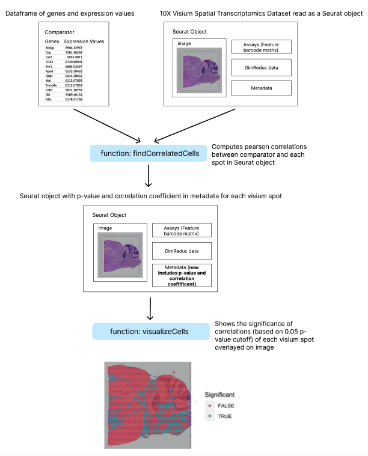

<!-- README.md is generated from README.Rmd. Please edit that file -->

```{r, include = FALSE}
knitr::opts_chunk$set(
  collapse = TRUE,
  comment = "#>",
  fig.path = "man/figures/README-",
  out.width = "100%"
)
```

# pearsonCorrelateCells

<!-- badges: start -->
<!-- badges: end -->

`pearsonCorrelateCells` is an R package that works with [10X Visium Spatial Transcriptomic](https://www.10xgenomics.com/products/spatial-gene-expression) data. The package is developed to allow the identification and visualization of cells that exhibit gene expression patterns correlated with that of a comparator. Correlations are calculated using Pearson Product-Moment Correlation. The comparator is a dataframe that contains gene names and corresponding expression values.

Gene expression data in the comparator can be taken from any source. Here are some anticipated use cases:

1) The comparator is averaged or differential expression of a cluster in RNA-sequencing data. The goal is to find cells in 10X Visium that are most similar to this cluster. 

2) The comparator is averaged gene expression of samples of interest in bulk RNA-sequencing data

The idea of this package came from a conversation with Professor Scott Yuzwa (personal communication, September 23, 2022). According to Professor Yuzwa, some researchers use pearson correlations to identify specific cell types in spatial transcriptomic data. 

This functions in this package work with 10X Visium Data that is loaded as a Seurat object. To learn how to load 10X Visium datasets as Seurat objects, please visit the [Seurat package vignette for working with 10X Visium](https://satijalab.org/seurat/articles/spatial_vignette.html). 

## Installation

You can install the development version of pearsonCorrelateCells from
[GitHub](https://github.com/) with:

``` r
require("devtools")
devtools::install_github("jessielam415/pearsonCorrelateCells", build_vignettes = TRUE)
library("pearsonCorrelateCells")
```
The shiny app in this package demonstrates the package's utility by allowing users to upload csv files of gene expression data. The gene expression data is correlated with each spot in a sample Visium spatial transcriptomic dataset. The chosen dataset is the 10X Genomics Visium Mouse Brain Dataset (Lab S, 2019).
To run the shinyApp:

``` r
pearsonCorrelateCells::runPearsonCorrelateCells()
```

## Overview

``` r
ls("package:pearsonCorrelateCells")
browseVignettes("pearsonCorrelateCells")
```

`pearsonCorrelateCells` has 2 functions:

* `findCorrelatedCells`: Computes the pearson correlation of the gene expression of the top expressed genes in a comparator dataframe and each spot in 10X Visium spatial dataset. Saves the p-value and correlation coefficient in the Visium object metadata for each spot.
* `visualizeCells`: Visualizes the significance of the pearson correlations of each spot obtained from the findCorrelatedCells function using the p-value <= 0.05 cutoff. Outputs a plot of each visium spot coloured by significance overlaying the Visium image.




## Contributions

The author of the package is Wing Chung Jessie Lam. 

The *findCorrelatedCells* function makes use of the arrange and slice functions from the dplyr r package, the cor.test function in the stats package, the rownames_to_column function from the tibble r package, the %>% function from the magrittr package, as well as the GetAssayData and AddMetaObject function from the Seurat package.

The *visualizeCells* function makes use the AddMetaData and SpatialPlot functions from the Seurat package.

The shiny package is used to create the Shiny application. 

The InstallData and LoadData functions from the SeuratData package is used to load the 10X Genomics Visium Mouse Brain Dataset into both the shiny app, and in the *findCorrelatedCells* and *visualizeCells* function documentation examples. 

## References

Bache S, Wickham H (2022). magrittr: A Forward-Pipe Operator for R. [https://magrittr.tidyverse.org](https://magrittr.tidyverse.org), [https://github.com/tidyverse/magrittr](https://github.com/tidyverse/magrittr).

Hao Y, Hao S, Andersen-Nissen E, III WMM, Zheng S, Butler A, Lee MJ, Wilk AJ, Darby C, Zagar M, Hoffman P, Stoeckius M, Papalexi E, Mimitou EP, Jain J, Srivastava A, Stuart T, Fleming LB, Yeung B, Rogers AJ, McElrath JM, Blish CA, Gottardo R, Smibert P, Satija R (2021). Integrated analysis of multimodal single-cell data. Cell. doi:10.1016/j.cell.2021.04.048, [https://doi.org/10.1016/j.cell.2021.04.048](https://doi.org/10.1016/j.cell.2021.04.048).

Lab S (2019). _stxBrain.SeuratData: 10X Genomics Visium Mouse
Brain Dataset_. R package version 0.1.1.

Müller K, Wickham H (2022). tibble: Simple Data Frames. [https://tibble.tidyverse.org/](https://tibble.tidyverse.org/), [https://github.com/tidyverse/tibble](https://github.com/tidyverse/tibble).

Silva A. (2022). Anjalisilva/TestingPackage: A Simple R Package Illustrating Components of an R Package: 2019-2022 BCB410H - Applied Bioinformatics, University of Toronto, Canada. GitHub. [https://github.com/anjalisilva/TestingPackage](https://github.com/anjalisilva/TestingPackage)

Tasic B, Menon V, Nguyen T. et al (2016). Adult mouse cortical cell taxonomy revealed by single cell transcriptomics. Nat Neurosci 19, 335–346. [https://doi.org/10.1038/nn.4216](https://doi.org/10.1038/nn.4216)

Wickham H, François R, Henry L, Müller K (2022). dplyr: A Grammar of Data Manipulation. [https://dplyr.tidyverse.org](https://dplyr.tidyverse.org), [https://github.com/tidyverse/dplyr](https://github.com/tidyverse/dplyr).

## Acknowledgements

This package was developed as part of an assessment for 2022 BCB410H: Applied Bioinformatics course at the University of Toronto, Toronto, CANADA. `pearsonCorrelateCells` welcomes issues, enhancement requests, and other contributions. To submit an issue, use the GitHub issues. 

